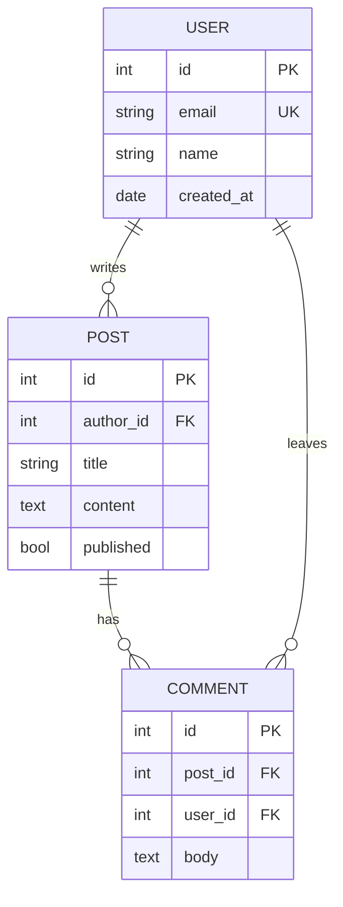
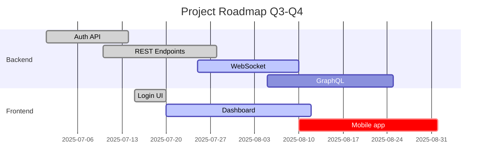
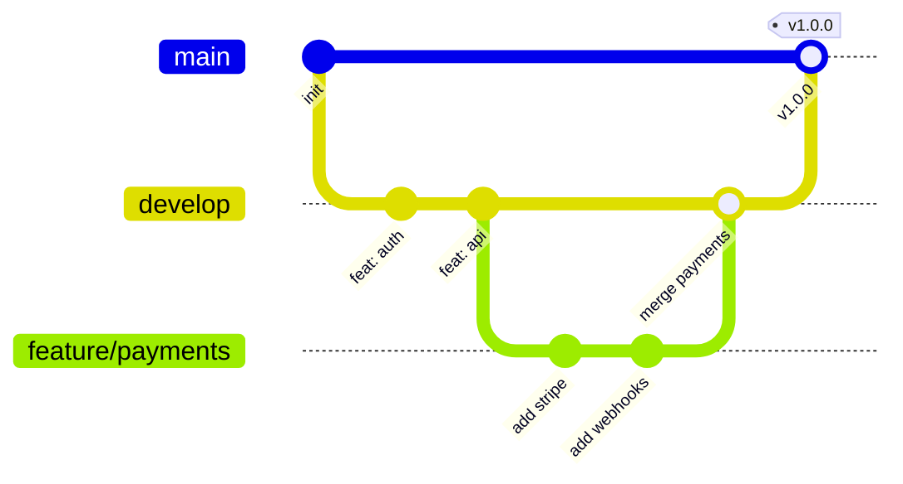

  <h1 align="center">Project Name</h1>
  
A brief description of what the project does and its purpose.

  
  

    <a href="./docs/getting_started.md">Installation</a> |
    <a href="./CONTRIBUTING.md">Contributing</a> |
    <a href="./docs/license.md">License</a> |
    <a href="./CODE_OF_CONDUCT.md">Code of Conduct</a> |
    <a href="./CHANGELOG.md">Changelog</a> |
    <a href="./SECURITY.md">Security</a> |
    <a href="./docs/api_reference.md">API Reference</a> |
    <a href="./docs/troubleshooting.md">Troubleshooting</a> |
    <a href="./docs/configuration.md">Configuration</a>
  

## Description

A brief description of what the project does and its purpose.

## Documentation

Additional Information

<!-- пустий рядок обов'язковий перед Markdown всередині -->

- [Installation](./docs/getting_started.md)
- [Contributing](./CONTRIBUTING.md) 
- [License](./docs/license.md) 
- [Code of Conduct](./CODE_OF_CONDUCT.md)
- [Changelog](./CHANGELOG.md)
- [Security](./SECURITY.md)
- [Api-Reference](./docs/api_reference.md)
- [Troubleshooting](./docs/troubleshooting.md)
- [Configuration](./docs/configuration.md)
  - [Environment Variables](#environment-variables)
  - [Database Setup](#database-setup)

  

## Посилання на конкретний розділ іншого файлу

See [Configuration](./docs/configuration.md#environment-variables)
See example get user endpoint in [API Reference](./docs/api-reference.md#get-users)

## Shortcuts

<kbd>Ctrl</kbd> + <kbd>K</kbd> - Open Command Palette 
<kbd>Ctrl</kbd> + <kbd>P</kbd> - Quick Open 
<kbd>Ctrl</kbd> + <kbd>Shift</kbd> + <kbd>P</kbd> - Show All Commands 
<kbd>Ctrl</kbd> + <kbd>Shift</kbd> + <kbd>O</kbd> - Go to Symbol 

