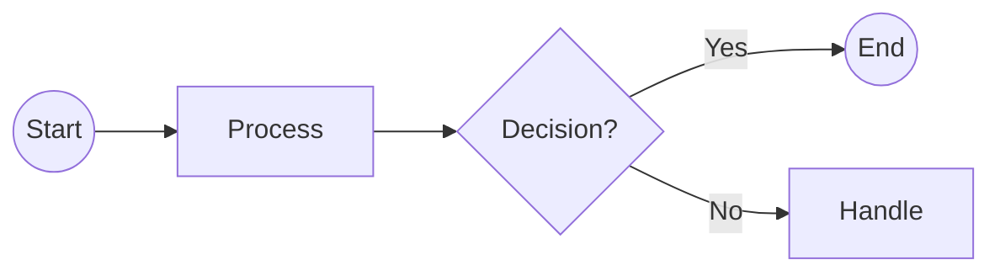

# API Reference

## `GET` /users

Short description of what this endpoint does.

### Request

```json
{
    "page": 1,
    "limit": 10
}
```

**Response** `200 OK`

```json
{
    "id": "12345",
    "name": "John Doe",
    "email": "john.doe@example.com"
}
```

> [!NOTE]
> Additional notes about this endpoint.

## `POST` /users

Short description of what this endpoint does.

### Request

```json
{
    "name": "John Doe",
    "email": "john.doe@example.com"
}
```

**Response** `201 Created`

```json
{
    "id": "12345",
    "name": "John Doe",
    "email": "john.doe@example.com"
}
```

> [!NOTE]
> Additional notes about this endpoint.

## Endpoints

| Endpoint             | Description          |
| :------------------- | :------------------- |
| `GET /users`         | Get a list of users. |
| `POST /users`        | Create a new user.   |
| `GET /users/{id}`    | Get a user by ID.    |
| `PUT /users/{id}`    | Update a user by ID. |
| `DELETE /users/{id}` | Delete a user by ID. |

## Diagram


