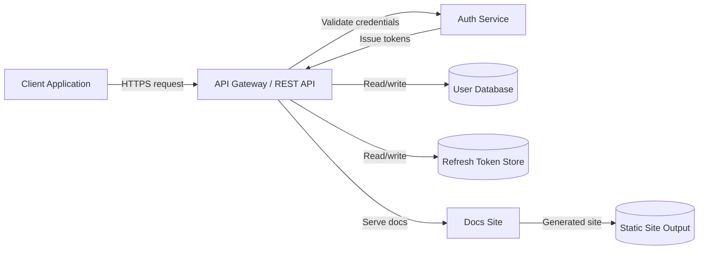
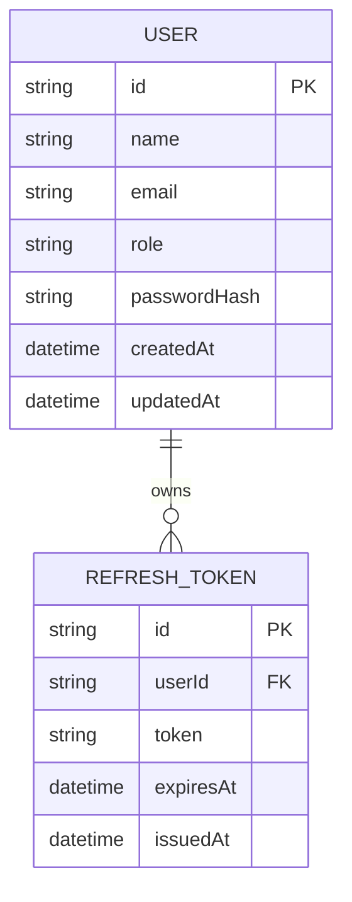
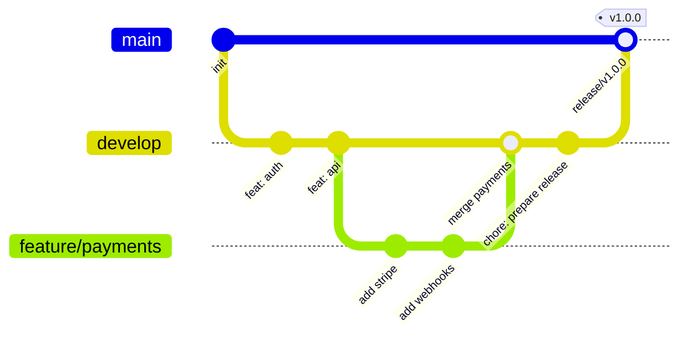

# Architecture

This document collects architecture-related information from existing documentation and presents it in a central place.

Sources:
- API endpoint descriptions from `docs/api-reference.md`
- System and database references from `README.md`
- Branching examples from `README.md` and `CONTRIBUTING.md`

## Overview

The project is built around a Markdown-first documentation platform with a backend API for user management and authentication.

Key architecture points extracted from existing docs:
- The API exposes user lifecycle endpoints such as `GET /users`, `GET /users/{id}`, `PUT /users/{id}`, and `DELETE /users/{id}`.
- Authentication is token-based with `POST /auth/login` and `POST /auth/refresh`.
- The system uses a database to store users and session tokens.
- The README references database setup and system removal flows.
- The Git workflow uses feature branches, a `develop` integration branch, and `main` for releases.

## System architecture

## Data model

## Git branching strategy

This strategy is inferred from README examples and contribution guidance.

- `main` is the stable production branch.
- `develop` is the integration branch for completed features.
- `feature/*` branches are used for individual work items.
- Feature branches merge into `develop`, then `develop` merges into `main` for release.

